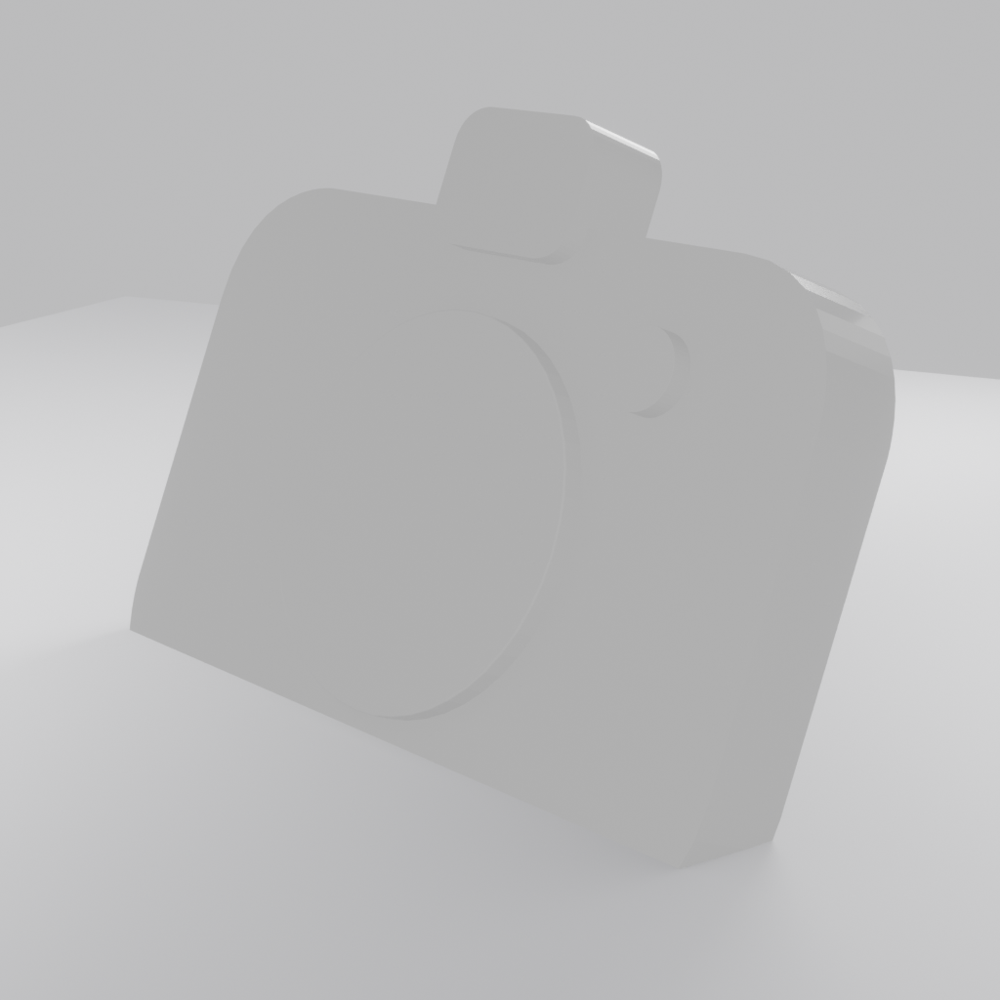
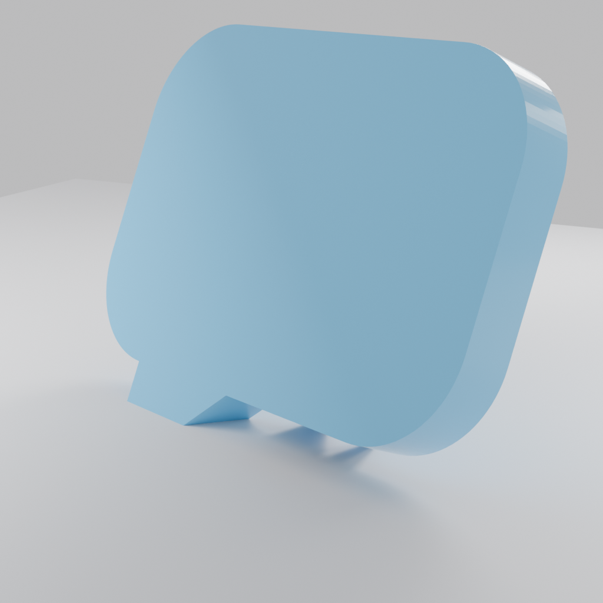
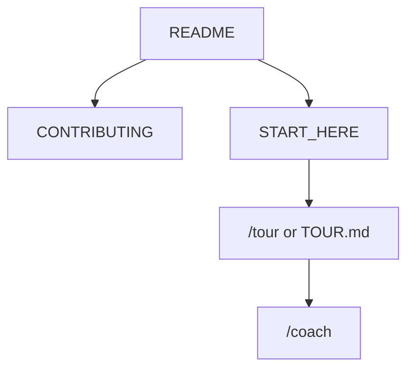

<!-- GENERATED by scripts/generate-project-readme.py — edit branding/product.json -->

  

<h1 align="center">Hover Icons</h1>

<strong>Simple 2D icons as glossy floating 3D objects</strong>

  
  
  
  
  
  
  

  
  
  
  
  
  
  
  

## Pitch

Hover Icons is a FOSS pack of simple, instantly recognizable 2D icons turned into photo-realistic 3D objects: slightly extruded, beveled, studio-lit, with tame or neon materials from one locked YAML catalog.

## Demo

  
  
  
  

  

First four goldens: camera and messages × tame / neon (1024×1024, Cycles OptiX).

## GitHub Pages Demo

The `examples/web` PWA deploys to GitHub Pages on push to `main`. Demo URL: [https://edwardlthompson.github.io/hover-icons/](https://edwardlthompson.github.io/hover-icons/).

## Features

- Locked prompt template plus YAML catalog — agents never free-form prompts
- Tame satin plastic and neon emissive presets on the same mesh
- Dry-run CI backend; local Blender/Cycles OptiX on a GPU for goldens
- Camera and messages as the first two icons (1024×1024, Android-safe padding)
- CC0 authored SVGs and generated PNGs; MIT code

## Quick start

1. Read AGENT.md, then the Product (do not drift) block in BUILD_PLAN.md.
2. Run `python3 scripts/validate_catalog.py` then `python3 scripts/render_icons.py --backend dry-run`.
3. On a CUDA box with official Blender, set BLENDER_BIN and render with `--backend blender --quality release`.

## For humans

Start with this README, then [`CONTRIBUTING.md`](CONTRIBUTING.md) and [`docs/BEST_PRACTICES.md`](docs/BEST_PRACTICES.md). The first-month playbook is [`docs/FIRST_30_DAYS.md`](docs/FIRST_30_DAYS.md).

## For agents

Read [`docs/START_HERE.md`](docs/START_HERE.md) and [`AGENTS.md`](AGENTS.md). In Cursor type `/tour` or `/bootstrap`. Any other IDE: ask the agent to read [`docs/help/TOUR.md`](docs/help/TOUR.md). `/coach` is the next recommended action.

## Install

Python 3.11+ and uv for the catalog CLI. Optional: official Blender 4.2+ with OptiX for photoreal PNGs. See docs/RENDER_BACKEND.md.

## Usage

Add an SVG under catalog/sources/, add a YAML block, validate, dry-run, then optionally Blender-render. Use `/verify` before merge.

## Configuration

Copy [`.env.example`](.env.example) to `.env` for local secrets (never commit `.env`). Stack-specific config lives in the active `examples/` or app root after prune.

## Contributing

See [`CONTRIBUTING.md`](CONTRIBUTING.md). Prefer small PRs; follow Conventional Commits and the BUILD_PLAN labels (`AGENT` / `HUMAN` / `ADB` / `AUTO`). Status markers: 🔲 open · ✅ done · ❌ blocked.

## Security

See [`SECURITY.md`](SECURITY.md). Enable Dependabot alerts and follow [`docs/SECURITY_TRIAGE.md`](docs/SECURITY_TRIAGE.md) for weekly CVE triage.

## License

[MIT License](LICENSE) — see the license file for terms.

## Acknowledgments

Scaffolded with [agent-project-bootstrap](https://github.com/edwardlthompson/agent-project-bootstrap). Brand assets: [`branding/BRANDING.md`](branding/BRANDING.md). Design system: [`docs/STYLE.md`](docs/STYLE.md).
