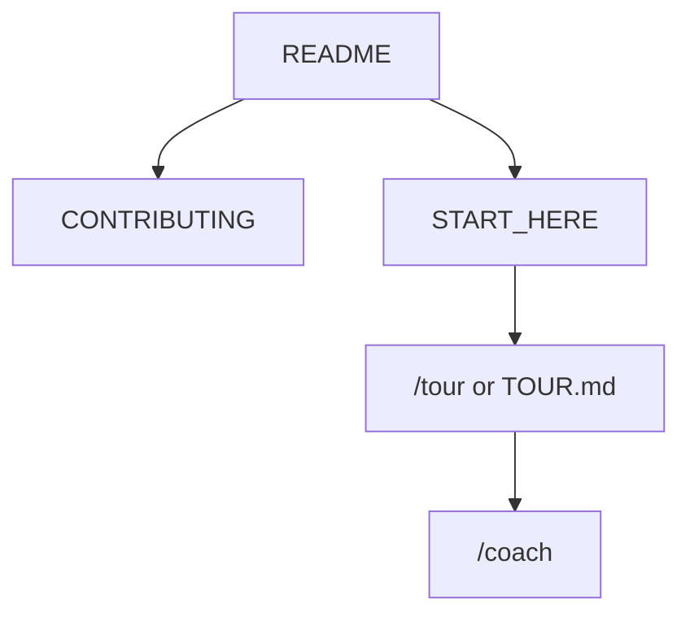

<!-- GENERATED by scripts/generate-project-readme.py — edit branding/product.json -->

  

<h1 align="center">{{name}}</h1>

<strong>{{tagline}}</strong>

  
  
  
  
  
  
  

  
  
  
  
  
  
  
  

## Pitch

{{pitch}}

## Demo

  
  
  
  

  

First four goldens: camera and messages × tame / neon (1024×1024, Cycles OptiX).

## GitHub Pages Demo

The `examples/web` PWA deploys to GitHub Pages on push to `main`. Demo URL: [https://{{pages_host}}/](https://{{pages_host}}/).

## Features

{{features}}

## Quick start

{{quick_start}}

## For humans

Start with this README, then [`CONTRIBUTING.md`]({{url_contributing}}) and [`docs/BEST_PRACTICES.md`]({{url_best_practices}}). The first-month playbook is [`docs/FIRST_30_DAYS.md`]({{url_first_30_days}}).

## For agents

Read [`docs/START_HERE.md`]({{url_start_here}}) and [`AGENTS.md`]({{url_agents}}). In Cursor type `/tour` or `/bootstrap`. Any other IDE: ask the agent to read [`docs/help/TOUR.md`]({{url_tour}}). `/coach` is the next recommended action.

## Install

{{install}}

## Usage

{{usage}}

## Configuration

Copy [`.env.example`]({{url_env_example}}) to `.env` for local secrets (never commit `.env`). Stack-specific config lives in the active `examples/` or app root after prune.

## Contributing

See [`{{url_contributing}}`]({{url_contributing}}). Prefer small PRs; follow Conventional Commits and the BUILD_PLAN labels (`AGENT` / `HUMAN` / `ADB` / `AUTO`). Status markers: 🔲 open · ✅ done · ❌ blocked.

## Security

See [`{{url_security}}`]({{url_security}}). Enable Dependabot alerts and follow [`docs/SECURITY_TRIAGE.md`]({{url_security_triage}}) for weekly CVE triage.

## License

[{{license_name}}]({{url_license}}) — see the license file for terms.

## Acknowledgments

Scaffolded with [agent-project-bootstrap](https://github.com/edwardlthompson/agent-project-bootstrap). Brand assets: [`{{url_branding}}`]({{url_branding}}). Design system: [`{{url_design}}`]({{url_design}}).
