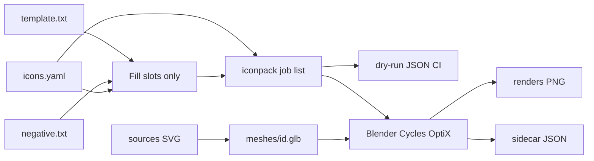

# Product Specification

> Hover Icons / photoreal-simple-icons. Feature slices still use `docs/features/{name}.md`.
> Status markers: 🔲 open · ✅ done · ❌ blocked.
> Canon: [`AGENT.md`](../AGENT.md). Daily board: [`BUILD_PLAN.md`](../BUILD_PLAN.md).

## Overview

**Product:** Hover Icons (pack name `photoreal-simple-icons`)
**Purpose:** FOSS GitHub-hosted icon pack of simple, instantly recognizable 2D icons turned into photo-realistic 3D objects: slightly extruded, beveled, floating at a gentle angle, studio-lit, with a faint contact shadow.
**Users:** App authors, Android/icon consumers, and agents that add icons only via YAML + SVG.
**Non-goals until the catalog works:** Android adaptive XML for every density; hundreds of icons in git; marketing site.

**One-liner:** Simple 2D icon → same outline in 3D → glossy floating object → tame or neon (and later materials) from one catalog.

`examples/python/src/hello/` is bootstrap CI glue, not the product.

## Functional Requirements & User Stories

| ID | Story | Acceptance |
|----|-------|------------|
| FR-1 | As an agent I fill prompts only from the locked template + catalog | No free-form prompt text; slots `[ICON_DESCRIPTION]`, `[COLOR]`, `[MATERIAL_AND_EFFECT]` only |
| FR-2 | As a maintainer I add an icon by dropping an SVG and a YAML block | `scripts/validate_catalog.py` fails if a `source` is missing |
| FR-3 | As a renderer I apply tame, neon, glass, metal, or ceramic to the same mesh | Effects are material strings + output folders; camera/messages first |
| FR-4 | As CI I validate the catalog without a GPU | Dry-run writes JSON sidecars; no CUDA/Blender/PNG requirement |
| FR-5 | As a human I get camera/tame then camera/neon then messages as goldens | Same camera, lights, 1024², Android-safe padding; silhouette stays the 2D icon |
## Non-Functional Constraints

- Code MIT; authored SVGs CC0; generated PNGs CC0; third-party 2D sources keep their licenses (`LICENSE-ASSETS.md`)
- No proprietary SDKs on the FOSS production path; CUDA/OptiX is a local optional renderer
- File budgets: 300 lines static data, 150 lines pure logic
- CI never requires Blender, CUDA, or photoreal PNGs
- Opt-in telemetry only; never enabled by default

## Architecture & Data Flow

Production renderer: Blender/Cycles OptiX on a local GPU (this host has an RTX 4090). CI backend: `dry-run`. Silhouette lock is the mesh from `source`, not ControlNet. Catalog still stores ControlNet type/weight for logs and a future lookdev backend.

## Test-first rule

Every feature in `docs/plan.md` / BUILD_PLAN must list tests, or state why automation is not feasible and name the fallback command. GPU tests are skipped unless `HOVER_ICONS_GPU=1`.
